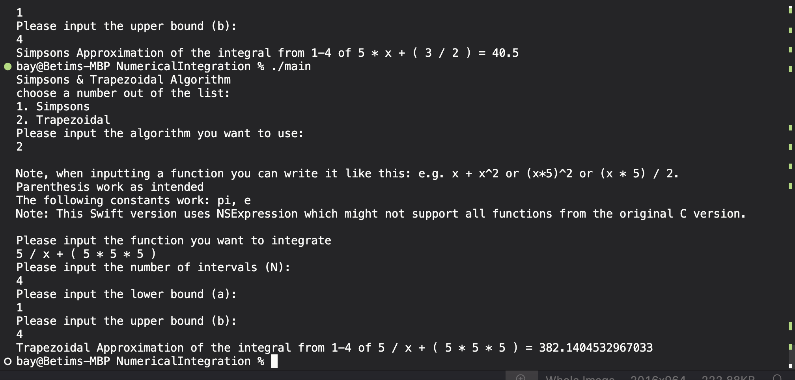

# Swift-Simp-Trap-rules
The swift version of Simpsons and trapezoidal numerical integration, prevously made in C.
This uses NSExpression from Apple's Foundation Library to handle user input of mathmatical functions.

## Description

- This program asks for user input on the number of intervals, the upper and lower bounds, and the function, and which approximation method to use.
- Depending on what the user chooses, program will approximate with either simpsons or trapezoidal rule, and parse through the function using tinyexpr library
- The program supports 
  - e.g. x + x * x // to mimick x^2 (doesn't us)
  - (x * 5) * 2 
  - (x * 5) / 2 

## Getting Started

### Dependencies
* Swiftc
* Swift Libraries imported: Foundation

### Installing & Executing

* First you need to clone this repo
* then run this command
```
git clone https://github.com/Betim-Hodza/Swift-Simp-Trap-rules.git
cd NumericalIntegration
swiftc main.swift
./main
```




## Authors

Betim Hodza 

## Sources
NSExpression Guide
https://medium.com/@elifedman/understanding-nsexpression-in-swift-a-beginners-guide-50b7baa36271
