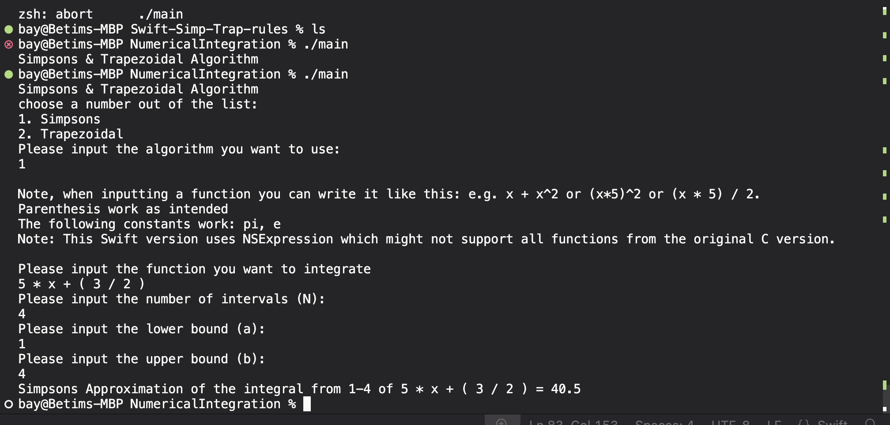

<div align="center">
  <h1>Swift-Simp-Trap-Rules<h1>
  <br />
  <a href="#about"><strong>Explore the screenshots »</strong></a>
  <br />
  <br />
</div>

<div align="center">
<br />

</div>

<details open="open">
<summary>Table of Contents</summary>

- [About](#about)
  - [Built With](#built-with)
- [Getting Started](#getting-started)
  - [Prerequisites](#prerequisites)
  - [Installation](#installation)
- [Usage](#usage)
- [Authors](#authors)
- [License](#license)
- [Sources](#sources)

</details>

---

## About

<table><tr><td>

> The swift version of Simpsons and trapezoidal numerical integration, prevously made in C.
> This uses NSExpression from Apple's Foundation Library to handle user input of mathmatical functions.

<details>
<summary>Screenshots</summary>
<br>

|                               Home Page                               |                               Login Page                               |
| :-------------------------------------------------------------------: | :--------------------------------------------------------------------: |
|  |  |

</details>

</td></tr></table>

### Built With

> Swift, Foundation, and NSExpression

## Getting Started

### Prerequisites

> swiftc, Foundation, NSExpression

### Installation

> to install run the command

``` git clone https://github.com/Betim-Hodza/Swift-Simpson-Trapaziod-rules.git ```

then cd NumericalIntegration, and run

```
swiftc main.swift
./swift
```

## Usage

- This program asks for user input on the number of intervals, the upper and lower bounds, and the function, and which approximation method to use.
- Depending on what the user chooses, program will approximate with either simpsons or trapezoidal rule, and parse through the function using tinyexpr library
- The program supports 
  - e.g. x + x * x // to mimick x^2 (doesn't us)
  - (x * 5) * 2 
  - (x * 5) / 2 

## Project assistance

If you want to say **thank you** or/and support active development of Swift-Simp-Trap-Rules:

- Add a [GitHub Star](https://github.com/Betim-Hodza/Swift-Simpson-Trapazoid-rule) to the project.

## Authors

The original setup of this repository is by [Betim Hodza](https://github.com/Betim-Hodza).

For a full list of all authors and contributors, see [the contributors page](https://github.com/Betim-Hodza/Swift-Simpson-Trapazoid-rule/contributors).

## License

This project is licensed under the **MIT license**.

See [LICENSE](LICENSE) for more information.

## Sources
NSExpression Guide
https://medium.com/@elifedman/understanding-nsexpression-in-swift-a-beginners-guide-50b7baa36271
